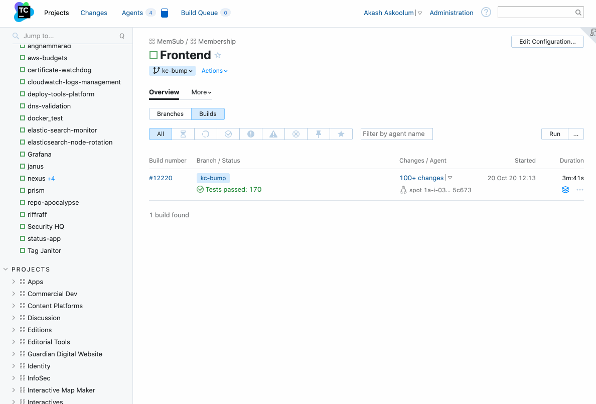
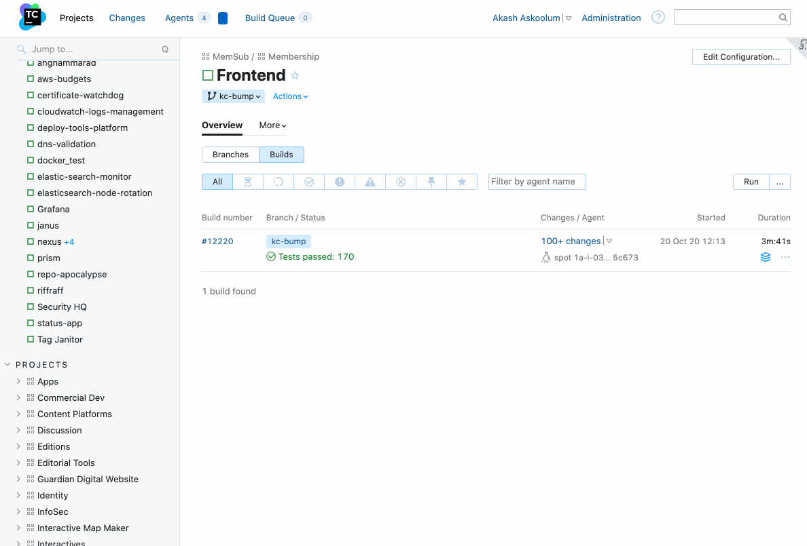
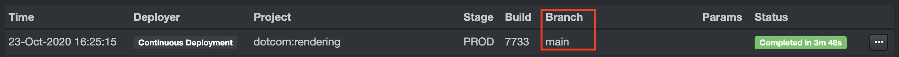

# Migrating

Follow this doc to migrate a repo's default branch from `master` to `main`.

## Background
Due to the negative meaning of `master` we are standardising on `main`.

This is a small step to make working here more inclusive for those who feel excluded by this term.
Although there is a small hassle in changing this, it is far less than the difficulties experienced by underrepresented groups in tech.
By doing this small work, this can encourage us to remember inclusivity as part of all our work.

For more background on this terminology, see [Changing terminology to be more descriptive and more inclusive](https://docs.google.com/document/d/17Hho66YJg8Xe8uS2OC75b0siETAx93JZORM4sVOS7Gk/edit).

For more about inclusive language see [Words Matter doc](https://github.com/guardian/managers-guide/blob/main/docs/guidelines/inclusive-communication.md) at the manager’s guide.

## Steps
Overall the process is:
1. Update GitHub
1. Update CI (typically TeamCity)
1. Update CD (typically RiffRaff)
1. Update Snyk
1. Perform a deploy to ensure everything is still working
1. Inform your team to update their clone

### Update GitHub
The [`master-to-main`](./README.md) script automates the GitHub phase and will create issues in your repo for the remaining steps to act as a checklist/reminder for you.

That is, run `npx @guardian/master-to-main` and :tada:.

The steps we go through have been inspired by [this doc](https://dev.to/rhymu8354/git-renaming-the-master-branch-137b).

#### Files in GitHub
`master-to-main` will also scan your repo for the word `master` and create an issue linking to them for you to update.

### Update CI (typically TeamCity)
1. Check branch filter in teamcity to make sure no special build for the default branch.
1. Edit VCS root default branch (TeamCity docs on VCS can be found [here](https://www.jetbrains.com/help/teamcity/configuring-vcs-settings.html)).
  
    Find project -> Edit Configuration -> Version Control Settings -> Edit -> General Settings -> Default branch

    

1. Check build steps for hard coded branch name.
  
    Find project -> Edit Configuration -> Build Steps

    

1. Update the `snyk monitor` build step's Main branch to use `main`.

### Update CD (typically RiffRaff)
You'll need to update RiffRaff to look at your new default branch. There will be an issue created in your repo with more details.

### Update Snyk
Change snyk GitHub integration(s) - it uses the default branch, but you will need to delete and re-import the project+file as this is the only way to refresh the default branch at present.

### Perform a deploy to ensure everything is still working
Create a small change and merge it.

RiffRaff should pick it up as normal. If enabled, a continuous deploy should also be triggered from the new default branch.



### Inform your team to update their clone
Anyone who has a local clone of the repo would need to run the following to move to `main`:

```sh
git fetch --all
git remote set-head origin -a
git branch --set-upstream-to origin/main
git branch -m master main
```
